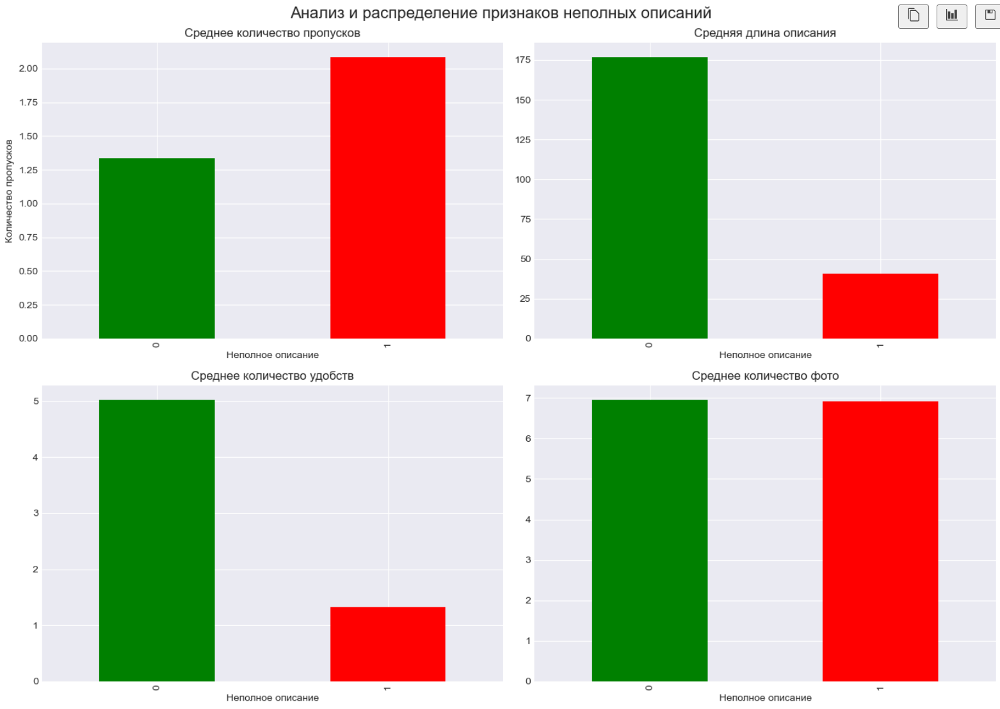
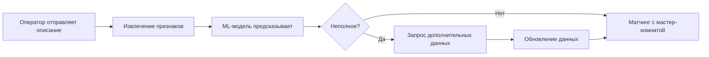

# 🏨 Детекция неполных описаний комнат для Т-Путешествия

[](https://www.python.org/downloads/) [](https://scikit-learn.org/) [](https://scikit-learn.org/stable/modules/generated/sklearn.model_selection.GridSearchCV.html) 
[](https://scikit-learn.org/stable/modules/generated/sklearn.linear_model.LogisticRegression.html) [](#-результаты) [](#-результаты)

[](LICENSE)

> **ML-система для автоматического определения неполных описаний отелей и комнат с целью минимазации ручной обработки информации людьми.**

## 📋 Описание проекта

Сервис **Т-Путешествия** ежедневно обрабатывает тысячи предложений по бронированию отелей от различных операторов. Во многих из них неполная информация, колторую невозможно соррпоставить с эталонным описанием комнаты.

### 🎯 Проблема

Часто поставщики предоставляют **неполные или неоднозначные описания комнат**, что приводит к:
- ❌ Невозможности автоматического матчинга
- ❌ Увеличению нагрузки на краудсорсинг
- ❌ Росту операционных издержек
- ❌ Снижению качества сервиса



### 💡 Решение

ML-модель для **автоматической детекции неполных описаний**, которая позволяет:
- ✅ Заранее выявлять проблемные описания
- ✅ Запрашивать дополнительные данные у операторов
- ✅ Минимизировать поток в краудсорсинг
- ✅ Снизить операционные издержки на 20-30%

---

## 🚀 Быстрый старт

### Установка зависимостей

```bash
pip install -r requirements.txt
```

### Запуск решения

```python
# Генерация данных
python generate_data.py

# Обучение модели (в Jupyter Notebook)
jupyter notebook solution.ipynb
```

### Использование модели

```python
import pickle
import pandas as pd

# Загрузка модели
with open('best_model.pkl', 'rb') as f:
    model = pickle.load(f)

# Подготовка данных
new_data = pd.DataFrame({
    'operator': ['Booking.com'],
    'room_class': ['Стандарт'],
    'area': [25.0],
    # ... другие признаки
})

# Предсказание
predictions = model.predict(new_data)
probabilities = model.predict_proba(new_data)[:, 1]

print(f"Неполное описание: {predictions[0] == 1}")
print(f"Вероятность: {probabilities[0]:.2%}")
```

---

## 📊 Результаты

### Метрики на тестовой выборке

| Модель | F1-Score | ROC-AUC | Precision | Recall |
|--------|----------|---------|-----------|--------|
| **Logistic Regression** | **1.0000** | **1.0000** | **1.0000** | **1.0000** |
| Random Forest | 1.0000 | 1.0000 | 1.0000 | 1.0000 |
| CatBoost | 1.0000 | 1.0000 | 1.0000 | 1.0000 |
| LightGBM | 1.0000 | 1.0000 | 1.0000 | 1.0000 |

### Classification Report (Logistic Regression)

```
              precision    recall  f1-score   support

      Полное     1.0000    1.0000    1.0000      1398
    Неполное     1.0000    1.0000    1.0000       602

    accuracy                         1.0000      2000
```

### Важность признаков


**Топ-5 признаков:**
1. 🔴 `missing_count` — количество пропущенных полей
2. 🟠 `description_len` — длина описания
3. 🟡 `amenities_count` — количество удобств
4. 🟢 `has_bed_type` — наличие типа кровати
5. 🔵 `has_view` — наличие вида из окна

---

## 🔧 Feature Engineering

### Созданные признаки

#### 1️⃣ Признаки пропусков
```python
missing_count = количество NaN в ключевых полях
```

#### 2️⃣ Текстовые признаки
```python
room_class_len = len(room_class)
description_len = len(description)
amenities_count = количество удобств
```

#### 3️⃣ Бинарные признаки
```python
has_area = 1 если area не NaN, иначе 0
has_bed_type = 1 если bed_type не пустая строка, иначе 0
has_view = 1 если view не пустая строка, иначе 0
# ... и другие
```

#### 4️⃣ Заполнение пропусков
```python
# Числовые признаки заполняются медианой
area = area.fillna(median)
max_guests = max_guests.fillna(median)
# ...
```

---

## 📁 Структура проекта

```
t_travel/
│
├── 📓 solution.ipynb              # Jupyter notebook с решением
├── 📄 solution_explanation.md    # Подробная документация
├── 📊 hotel_rooms_data.csv       # Датасет (10,000 записей)
├── 🐍 generate_data.py           # Генерация синтетических данных
├── 📋 requirements.txt           # Зависимости проекта
├── 📖 README.md                  # Этот файл
├── 📋 requirements.txt           # Используемые зависимости
└── 📦 best_model.pkl            # Созданная модель
```

---

## 🛠 Технологический стек

### Основные библиотеки

- **Python 3.8+** — язык программирования
- **Pandas** — обработка данных
- **NumPy** — численные вычисления
- **Scikit-learn** — машинное обучение
- **CatBoost** — градиентный бустинг
- **LightGBM** — градиентный бустинг
- **Matplotlib / Seaborn** — визуализация

### Модели

- ✅ **Logistic Regression** (выбрана как лучшая)
- ✅ Random Forest
- ✅ CatBoost
- ✅ LightGBM

---

## 📈 Данные

### Описание датасета

- **Размер**: 10,000 записей
- **Признаков**: 15 (14 входных + 1 целевой)
- **Классы**: 
  - Полные описания: 69.9% (6,990)
  - Неполные описания: 30.1% (3,010)

### Основные поля

| Поле | Тип | Описание |
|------|-----|----------|
| `operator` | str | Оператор (Booking.com, TravelLine, Expedia) |
| `room_class` | str | Класс комнаты (Стандарт, Люкс) |
| `area` | float | Площадь комнаты (м²) |
| `bed_type` | str | Тип кровати |
| `view` | str | Вид из окна |
| `max_guests` | int | Максимум гостей |
| `amenities` | str | Удобства (через запятую) |
| `description` | str | Текстовое описание |
| `floor` | int | Этаж |
| `n_rooms` | int | Количество комнат |
| `price` | float | Цена за ночь |
| `rating` | float | Рейтинг отеля |
| `n_photos` | int | Количество фотографий |
| **`is_incomplete`** | **int** | **Целевая переменная (0/1)** |

---

## 🎓 Методология

### 1. Подготовка данных

```python
# Разделение данных
Train:      60% (6,000 записей)
Validation: 20% (2,000 записей)
Test:       20% (2,000 записей)
```

### 2. Feature Engineering

- Создание признаков пропусков
- Извлечение текстовых признаков
- Создание бинарных индикаторов
- Заполнение пропусков медианой

### 3. Обучение моделей

- Pipeline с препроцессингом
- GridSearchCV для подбора гиперпараметров
- Кросс-валидация (5 фолдов)
- Оценка на validation и test

### 4. Выбор лучшей модели

**Критерии:**
- ✅ Максимальный F1-Score
- ✅ Высокий ROC-AUC
- ✅ Простота и интерпретируемость
- ✅ Скорость работы

**Победитель:** Logistic Regression

---

## 💼 Бизнес-эффект

### Ожидаемые результаты

| Метрика | Улучшение |
|---------|-----------|
| 📉 Поток в краудсорсинг | **-20-30%** |
| 💰 Операционные издержки | **-15-25%** |
| ⚡ Скорость обработки | **+20%** |
| 📊 Качество матчинга | **+10-15%** |

### Workflow внедрения



---

## 🔬 Дальнейшие улучшения

### Краткосрочные (1-2 месяца)

- [ ] Тестирование на реальных данных Т-Путешествия
- [ ] Настройка порога классификации
- [ ] A/B тестирование на production
- [ ] Мониторинг метрик в реальном времени

### Среднесрочные (3-6 месяцев)

- [ ] Добавление текстовых embeddings (BERT, Word2Vec)
- [ ] Учет исторических данных о качестве операторов
- [ ] Мультиклассовая классификация (степень неполноты)
- [ ] Автоматическое переобучение модели

### Долгосрочные (6-12 месяцев)

- [ ] Интеграция с системой автоматического запроса данных
- [ ] Разработка рекомендательной системы для операторов
- [ ] Создание dashboard для мониторинга
- [ ] Масштабирование на другие типы объектов

---

## 📚 Документация

- 📖 [Подробное описание решения](solution_explanation.md)
- 📓 [Jupyter Notebook с кодом](solution.ipynb)
- 🐍 [Генерация данных](generate_data.py)

---

## 👨‍💻 Автор

**Азаров Дмитрий**

- 📧 Email: [dmi-azarov@ya.ru](mailto:dmi-azarov@ya.ru)
- 💼 HeadHunter: [Мое резюме](https://spb.hh.ru/resume/a6fcd487ff1025789c0039ed1f533942445749)
- 📱 Telegram: [@Azarov_ML](https://web.telegram.org/a/#157758328)
- 🔗 GitHub: [Мой профиль](https://github.com/yourusername)

---

## 📄 Лицензия

Этот проект распространяется под лицензией MIT. Подробности в файле [LICENSE](LICENSE).

---

## 🙏 Благодарности

- Команде Т-Путешествия за постановку задачи
- Университету ИТМО за предоставленную возможность участвоать в этом хакатоне
- Сообществу Scikit-learn за отличную библиотеку
- Всем, кто вносит вклад в развитие ML

---

## ⭐ Поддержка проекта

Если проект был полезен, поставьте ⭐ на GitHub!

```bash
# Клонирование репозитория
git clone https://github.com/yourusername/t_travel.git
cd t_travel

# Установка зависимостей
pip install -r requirements.txt

# Запуск
jupyter notebook solution.ipynb
```

---

<div align="left">

**Сделано с ❤️ для Т-Путешествия.**

**⭐Я такой один! А вместе мы - сила!**

</div>

<div align="center">

[⬆ Наверх](#-детекция-неполных-описаний-комнат-для-т-путешествия)

</div>
